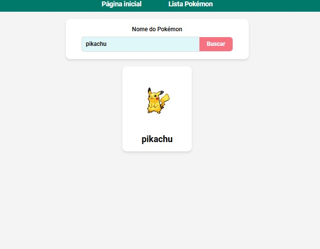
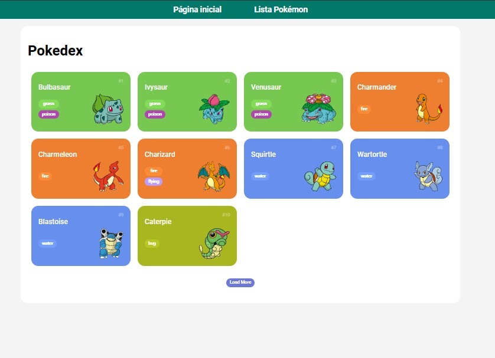

# pokedex
 Projeto do curso Formação javascript develop 
 
Objetivo: Conecta na api do pokedex e retorna informações sobre os pokemon

### Na tela inicial, faz a busca do pokemon, retornando o nome e imagem 

 
### Faz a listagem de todos os pokemon 

Referências:  
https://pokeapi.co/docs/v2#pokemon-section
